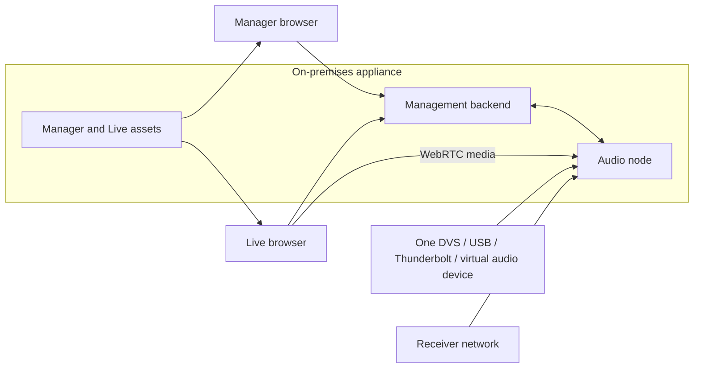

# Deployment topologies

**Status:** Proposed

Component boundaries are stable even when processes share a machine. This lets
the product begin as a simple appliance and grow into larger deployments
without rewriting the show model or operator applications.

## Standard single-appliance deployment

This is the first supported product profile. It minimizes deployment and
certificate complexity while preserving process isolation. It is supported
only after ADR 0007's combined adversarial resource test passes. If the host
cannot preserve capture/live-media reservations, backend and attachment workers
move to a separate control host or rich collaboration is disabled during an
active performance.

Recommended network attachment:

- dedicated wired interface for Dante/audio;
- receiver-control interface or explicitly approved shared production network;
- separate wired client/control interface feeding the venue access point; and
- no application-level bridge between those networks.

The host disables IP forwarding, applies a default-deny firewall, binds each
service to named interfaces, confines discovery multicast, and exposes WebRTC
candidates only on the client/control interface. The appliance must fail closed
if interface identity changes or becomes ambiguous.

## Split audio-node deployment

The audio node runs beside DVS/audio hardware while the backend and web assets
run elsewhere on the local control network.

Requirements:

- outbound mutually authenticated node-to-backend control connection;
- direct client reachability to the node's authorized WebRTC endpoint;
- direct, lease-authorized Live control reachability to the node;
- explicit node enrollment and certificate rotation;
- bounded reconnect/reconciliation behavior; and
- no public-internet dependency for local show operation.

Use this when the audio network location, host OS, redundancy, or machine-room
layout makes a single appliance unsuitable.

## Future multi-node deployment

One show may activate immutable configuration revisions on several audio nodes.
The backend presents a unified source model while preserving node ownership and
health. Audio does not transit the backend merely to appear centralized.

Open design questions include:

- cross-node replay alignment and clock evidence;
- client handoff or simultaneous buses across nodes;
- deterministic partial activation and rollback;
- capacity placement; and
- behavior when only part of a show can reach the backend.

Multi-node support is not an MVP promise. Contracts should avoid preventing it,
but no complexity should be added without a validated production need.

## Connectivity matrix

| From | To | Purpose | Direction |
| --- | --- | --- | --- |
| Selected audio device | Audio engine | Multichannel PCM | ASIO, WASAPI, or Core Audio |
| Receiver | Node adapter | Discovery, control, telemetry | Local network |
| Audio node | Backend | Enrollment, health, normalized state | Outbound persistent |
| Backend | Audio node | Activated revision and authorized control | Existing session |
| Manager | Backend | Show building and administration | HTTPS/WebSocket |
| Live | Backend | State, commands, signaling | HTTPS/WebSocket |
| Backend | Live | Signed node-control/media lease | HTTPS/WebSocket |
| Live | Audio node | WebRTC media always; direct scoped commands only for an established session during backend interruption | Secure leased session |
| Audio node | Live | Personal monitor media | WebRTC/SRTP |

The browser has no route or credential path to DVS, Dante control, or receiver
management APIs.

The standard local profile uses interface-scoped host ICE candidates and no
public STUN/TURN dependency. A split-site or routed deployment that needs a
local TURN service requires a separate validated profile.
