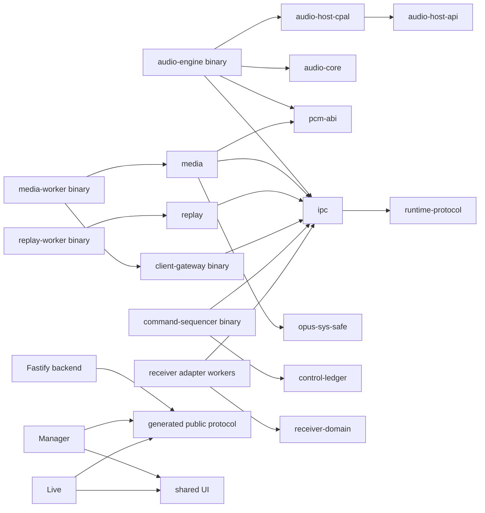

# Implementation and workspace structure

**Status:** Hypothesis; no supporting evidence. See [open questions](../open-questions.md).

This document turns ADRs 0014–0018 into a repository dependency map. It does
not imply that empty packages must be created before their phase begins.

## Target tree

```text
.
├── apps/
│   ├── manager/                  # independent React/Vite build
│   └── live/                     # independent React/Vite build
├── crates/
│   ├── audio-core/               # bounded DSP, meters and mix buses
│   ├── audio-host-api/           # project-owned device/stream contract
│   ├── audio-host-cpal/          # replaceable CPAL implementation
│   ├── pcm-abi/                  # dependency-free shared PCM byte contract/model
│   ├── ipc/                      # shared rings and local control framing
│   ├── media/                    # Opus/WebRTC session logic
│   ├── opus-sys-safe/            # only audited libopus FFI leaf
│   ├── replay/                   # replay segment/read model
│   ├── receiver-domain/          # normalized receiver types/capabilities
│   ├── control-ledger/           # canonical sequencer and durable append API
│   ├── client-gateway/           # lease/signature checks; no canonical append
│   ├── runtime-protocol/         # generated Protobuf transport DTOs
│   └── telemetry/                # metrics/log vocabulary and redaction
├── services/
│   ├── audio-node/
│   │   └── src/bin/
│   │       ├── audio-engine.rs
│   │       ├── media-worker.rs
│   │       ├── replay-worker.rs
│   │       ├── command-sequencer.rs
│   │       ├── client-gateway.rs
│   │       ├── receiver-adapter.rs
│   │       └── node-supervisor.rs
│   ├── backend-supervisor/       # Rust launcher for pinned Node/backend tree
│   └── backend/
│       └── src/
│           ├── auth/             # identity, policy and leases
│           ├── domain/           # show/performance/collaboration logic
│           ├── http/             # Fastify REST and static host
│           ├── subscriptions/    # WebSocket deltas and signaling
│           ├── persistence/      # repositories, migrations, storage worker
│           └── jobs/             # bounded import/export/media requests
├── integrations/
│   ├── sennheiser-ewdx/          # Rust worker/parser plus fixtures
│   └── shure/                    # Rust worker/parser plus fixtures
├── packages/
│   ├── protocol/
│   │   ├── schema/               # authoritative public JSON Schema
│   │   ├── proto/                # native process transport only
│   │   ├── generated/            # generated Rust/TypeScript DTO artifacts
│   │   ├── fixtures/             # positive/negative/golden vectors
│   │   └── specification.md
│   └── ui/
│       ├── tokens/               # colours, spacing, typography and status
│       ├── primitives/           # accessible headless interactions
│       └── visualization/        # bounded meter/trace/timeline rendering
├── infra/appliance/
│   ├── windows/                  # WiX, ACL, firewall and logon-task authoring
│   └── macos/                    # package, signing and LaunchAgent authoring
├── tests/
│   ├── contracts/                # cross-language and schema behavior
│   ├── integration/              # synthetic multi-process scenarios
│   ├── performance/              # latency/resource harnesses
│   ├── hardware/                 # HIL orchestration, never ordinary CI
│   └── fixtures/                 # licensed/generated deterministic inputs
└── tools/                        # evidence, code generation and release tools
```

The exact crate/package split may be combined when two units have no real
independent boundary. It may not be collapsed across an accepted failure,
privilege or Manager/Live boundary merely to reduce project count.

## Dependency direction



Rules:

- `audio-core` has no CPAL, networking, filesystem, database, UI or logging
  dependency. It accepts fixed buffers/commands and returns bounded output.
- `audio-host-api` has no CPAL types. Only the composition binary imports the
  selected host implementation.
- `pcm-abi` owns the dependency-free shared PCM descriptor/region layout,
  consumer-control bytes and deterministic state-machine model. OS mapping,
  handle, ACL and process code stays in platform/supervisor leaves; the current
  model is not a complete byte ABI or concurrent mapping implementation.
- `opus-sys-safe` is the only project crate permitted to call `libopus` FFI.
- `ipc` and generated native DTOs contain transport mechanics, not show-domain
  authority decisions.
- receiver adapters depend inward on normalized receiver contracts; backend and
  UI code never imports vendor parsers or vendor wire structures.
- the media worker terminates SCTP but cannot append canonical state; it forwards
  bounded untrusted bytes to the client gateway, which validates leases and
  signatures before the command sequencer sees a command.
- only the command sequencer imports the `control-ledger` append capability.
- backend packages do not import Rust/native crates. They communicate through
  versioned network contracts.
- `apps/manager` and `apps/live` do not import one another. Both may import only
  explicitly public paths from `packages/protocol` and `packages/ui`.
- Live's production graph contains no Manager route, editor, administrator or
  bulk-import module, even if tree shaking would appear to remove it.
- no package imports from `tests`, `tools`, `infra` or generated build output.

CI enforces these rules with Cargo/npm metadata inspection and frontend bundle-
graph assertions before Phase 0B promotion.

## Contract ownership

Public REST/WebSocket JSON Schema is authoritative under
`packages/protocol/schema`. OpenAPI and AsyncAPI reference those schemas rather
than copying them. Generators produce transport DTOs and clients; handwritten
domain types wrap generated inputs when invariants require it.

Protobuf under `packages/protocol/proto` describes local native worker IPC only.
It does not replace canonical JSON for signed commands/evidence and never
encodes PCM.

Generated files are committed only when a consumer or release build requires
them. Every generated file identifies its source and regeneration command. CI
runs generation and rejects a dirty diff. Generated files are never edited by
hand.

## Workspace and naming rules

- Rust crates use `a2-` package names and snake-case Rust module names.
- npm workspaces use private `@a2-monitor/*` names.
- executable names include their boundary (`a2-audio-engine`,
  `a2-media-worker`, `a2-node-supervisor`, `a2-backend`).
- one root `Cargo.lock` and one root `package-lock.json` are committed.
- application/library versions come from one release version source; protocol
  and schema versions remain independent compatibility numbers.
- release artifacts embed commit, dirty-state, toolchain, dependency lock hash,
  protocol/schema range and build timestamp.

## Build and test ownership

Every workspace owns `format`, `lint`, `test` and `build` behavior in its native
tool. Root commands are thin orchestration, not a replacement build system.

Pull-request CI:

1. validates Markdown, JSON Schema, ADR presence and repository policy;
2. regenerates contracts and checks for a clean diff;
3. runs TypeScript type/lint/unit checks and independent Manager/Live builds;
4. runs Rust format/Clippy/unit/contract tests on Windows and macOS;
5. checks licences, vulnerabilities, secrets and SBOM inputs; and
6. runs synthetic cross-process integration tests.

Scheduled/manual evidence jobs add physical devices, browsers, network faults,
installers, signing, power cuts, soaks and operator exercises. A pull-request
compile never marks a hardware tuple supported.

## Scaffold order

1. Add empty Cargo/npm workspace roots, pinned toolchains and CI caches.
2. Move the existing public schemas into their stable subdirectory without
   changing schema IDs; add deterministic generation and golden-vector checks.
3. Create `audio-host-api`, `audio-core`, `ipc` and a synthetic capture binary.
4. Create independent backend, Manager and Live health/snapshot skeletons.
5. Add the sequencer, client gateway, receiver worker and independently
   supervised backend/native process skeletons plus packaging-layout smoke tests.
6. Begin Phase 0A hardware capture; do not wait for final UI design.
7. Add the Opus/`str0m` media worker only after capture/timing instrumentation
   is stable enough to preserve causal measurements.

Scaffolding does not add production dependencies “just in case.” Each package
enters with an owner, licence, pinned version, update policy and a test that
uses the capability it was added to provide.
