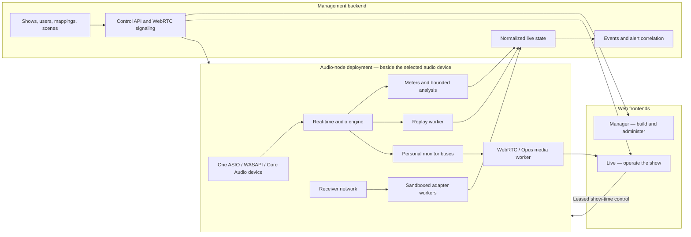

# System architecture

**Status:** Accepted boundary and technology baseline; audio/media library
compatibility remains evidence-gated.

## Central decision

The product has three responsibility areas and four code components:

1. a minimally managed, hardware-adjacent **audio node**;
2. a **management backend** for shows, users, mappings, state, and
   orchestration; and
3. two **web frontends**: Manager for Build/admin work and Live for show
   operation.

They may share one appliance in the standard deployment, but they communicate
through versioned contracts as if separately deployed. The browser does not
receive Dante directly or decode every monitored channel.

## Planes

### Audio node

Responsibilities:

- cross-platform enumeration and capture from exactly one selected audio device;
- device clock, capture epochs, and discontinuity observation;
- local receiver discovery and vendor adapters where network proximity is
  required;
- sample conversion and channel routing;
- real-time metering and bounded DSP;
- personal mix buses;
- replay write/read timing;
- encoder input; and
- underrun, overrun, and discontinuity metrics.

The node exposes only bootstrap, health, diagnostics, media, and versioned
control protocols. It has no show builder or user-management interface. The
deployment is internally split into a real-time audio engine, media worker,
replay worker, vendor adapter workers, and supervisor. The callback performs
bounded work with preallocated memory and communicates through bounded
lock-free or wait-free handoffs where practical. Network-facing parsers cannot
share the audio engine's privilege or failure domain.

The node stores the last activated show configuration and can continue capture,
monitoring, replay, and existing local operation through a temporary backend
disconnect. Configuration changes wait until control is restored.

### Management backend

Responsibilities:

- authentication and authorization;
- show configuration and persistence;
- source/channel/group state;
- WebRTC signaling, scoped node-control/emergency-overlay lease issuance, and
  session lifecycle;
- device-adapter orchestration;
- event correlation;
- client state subscriptions; and
- audit/event history.

The backend is authoritative for intended configuration; the audio node is
authoritative for observed hardware and real-time state. For an active
performance, the activated node is also the sole sequencer for cue occurrences
and runtime assignment overlays; the backend authorizes/routes and projects
those events. Reconciliation is explicit after reconnect. Restarting the backend
may briefly interrupt new commands or sessions but must not halt the audio node.

### Web frontends

Responsibilities:

- dense channel overview;
- operator-specific layouts and groups;
- listen, replay, cues, approved cast/mic swaps, notes, incident ownership, and
  acknowledgement controls;
- health and latency visibility; and
- permissions and session UX.

The web layer is split into two applications over the same domain contracts:

- **Manager:** inventory, sources, audio/radio pairing, groups, scenes, users,
  alert rules, and show activation.
- **Live:** dense monitoring, listening, replay, mic check, notes, incidents,
  and acknowledgements.

They may share design tokens and bounded visualization components, but the Live
app must not load Manager-only workflows or dependencies during a show.

Meters and timelines should use Canvas/WebGL or an equivalently bounded render
path. The UI must remain usable when telemetry is stale and visibly distinguish
stale, disconnected, muted, and healthy states.

### Integration plane

Each adapter converts vendor-specific discovery, identity, authentication,
units, warnings, and subscriptions into the domain contract. Hardware-facing
adapter code runs with the audio node when the device is reachable only from
the local production network. Adapter management and show binding remain in
the backend. Vendor message structures may not leak into backend domain or UI
code.

## Process isolation

The initial expectation is multiple supervised processes plus two separately
built web bundles:

1. a minimally privileged audio engine with exclusive access to one device;
2. an unprivileged WebRTC data-channel control gateway plus node supervisor, media, replay,
   and adapter workers with least privilege;
3. a management backend; and
4. a static frontend host, which may be served by the backend package.

The frontend host serves independent Manager and Live artifacts.

The node's internal PCM/control IPC is selected by ADR 0016; its exact ABI is
validated in Phase 0A. The node/backend network transport remains versioned and
evidence-gated. The node should establish an outbound,
mutually authenticated control connection when split across hosts. It must
reject unbounded client creation or configuration changes that would violate
its declared resource envelope.

## Data paths

### Live listening

1. DVS supplies multichannel PCM to the audio engine.
2. The node writes samples into a user's persistent stereo mix bus.
3. The backend authorizes the session and issues a scoped node-control lease.
4. While healthy, Live sends bounded controls through the backend to the node;
   during backend interruption an established client uses the reliable ordered
   data channel on the existing media peer connection. The node changes bus
   routing without changing the media track.
5. The node sends continuous Opus media directly to the client.
6. The browser renders through the explicitly selected output device.

### Telemetry

1. A node-local adapter discovers and authenticates to a receiver.
2. Subscribed vendor state is normalized with source and receive timestamps.
3. The node publishes normalized observations to the backend.
4. The backend updates live state, evaluates cross-source alert rules, and
   sends compact deltas to clients independently of audio.

### Replay

1. All audio blocks receive an epoch-scoped sample position from the one active
   device clock.
2. Audio and telemetry are written to time-indexed rolling storage.
3. The replay worker reads/prefetches and mixes selected historical channels
   without file I/O in the audio engine.
4. The media worker switches the user's existing WebRTC track between bounded
   live-mix and prebuffered replay sources.
5. Other users and live capture continue unaffected.

## Network boundaries

- The appliance Dante interface is always wired.
- Client Wi-Fi terminates on a separate control interface/network.
- Networks are not bridged by the application.
- IP forwarding is disabled and the host firewall defaults to deny.
- Services bind explicitly to approved interfaces.
- WebRTC candidates expose only the client/control interface.
- Receiver credentials and Dante control are never exposed to browser clients.
- Internet loss must not affect capture, live listening, replay, or local auth.

See [single-device capture](../decisions/0003-cross-platform-single-capture-device.md),
[active-performance authority](../decisions/0004-active-performance-command-authority.md),
[appliance resource isolation](../decisions/0007-appliance-resource-isolation.md),
[native runtime/audio host](../decisions/0014-rust-audio-runtime-and-host-boundary.md),
[application stack](../decisions/0015-typescript-fastify-react-application-stack.md),
[local IPC](../decisions/0016-shared-memory-and-protobuf-local-ipc.md),
[media worker](../decisions/0017-str0m-webrtc-media-worker.md),
[time and replay](time-and-replay.md), and
[failure/degraded modes](failure-and-degraded-modes.md).
